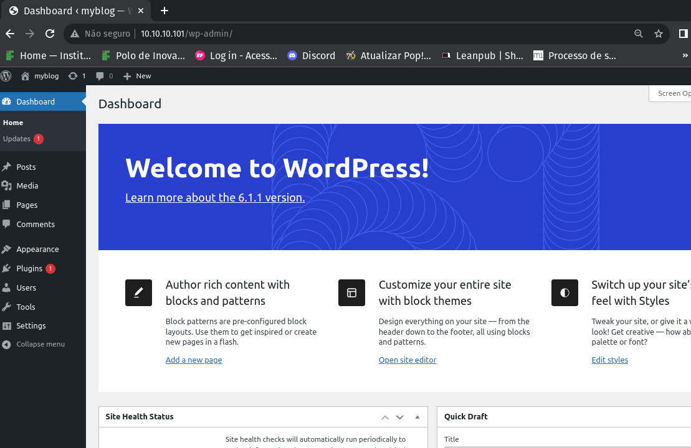
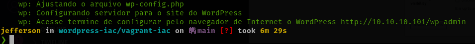
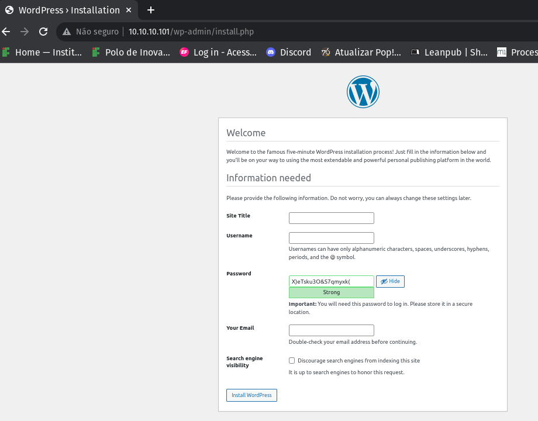

# wordpress-iac - Vagrant

Vagrant é uma ferramenta de linha de comando que gerencia e cria maquinas virtuias (VMs). Isolando as dependências e suas configurações em um único ambiente descartável e consistente.


fonte: https://developer.hashicorp.com/vagrant

## Executando localcamente o WordPress

### Dashbord do WordPress



1. Instalar as dependêncies:

   1. [VirtualBox](https://www.virtualbox.org/wiki/Downloads)
   1. [Vagrant](https://www.vagrantup.com/downloads)

2. Clonar o reposiotorio:

```bash
git clone https://github.com/Jefferson-LFS/wordpress-iac.git
cd wordpress-iac
cd vagrant-iac
```

#### Comandos

Os comandos do Vagrant devem ser executados no mesmo diretório do arquivo `Vagrantfile`, como mostra os exemplos:

```bash
vagrant up # cria a VM
vagrant halt # desliga a VM
vagrant destroy # desliga e destroy a VM
vagrant ssh wp # acessa a 'wp' via SSH
```

3. Criando ambiente

Você deve executar `vagrant up` para criação da máquina e provisionamento do wordPress. Na primeira vez que for excutado esse comando, a imagem da VM especificada no `Vagrantfile` será baixada isso pode levar algum tempo.

```bash
vagrant up
```

No final da excução do comando anterior aparecerá o endereço para terminar a instalação do site WordPress:



Acessando a Interface Web do WordPress.


